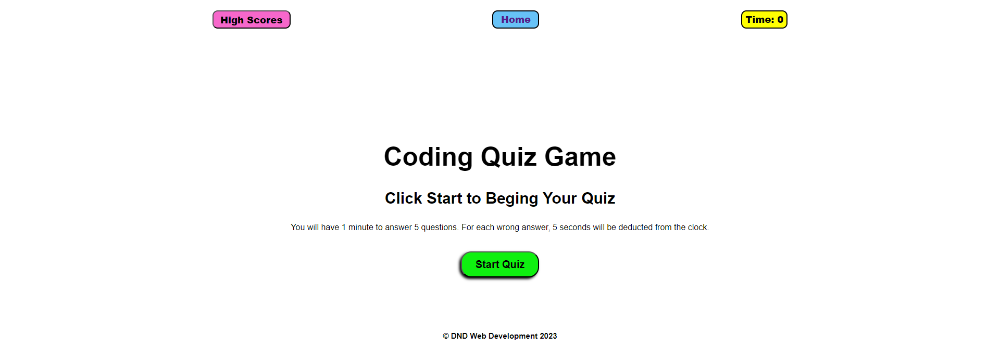

# Coding Quiz Game

## Description
This a short, timed, quiz game that saves scores on local storage for display in a "High Scores" section.
As a coding bootcamp student, I created this quiz as a means of practicing DOM navigation and manipulation using Javascript.
I created and removed elements, set element attributes, and stored and pulled data from the browser's local storage.

## Usage
Github Pages URL: https://danidrury.github.io/quiz-game/

## Credits
Delay function code from: https://masteringjs.io/tutorials/fundamentals/wait-1-second-then  
Debugging assistance provided by classmate, Sarun Thunyapauksanon

## License
n/a